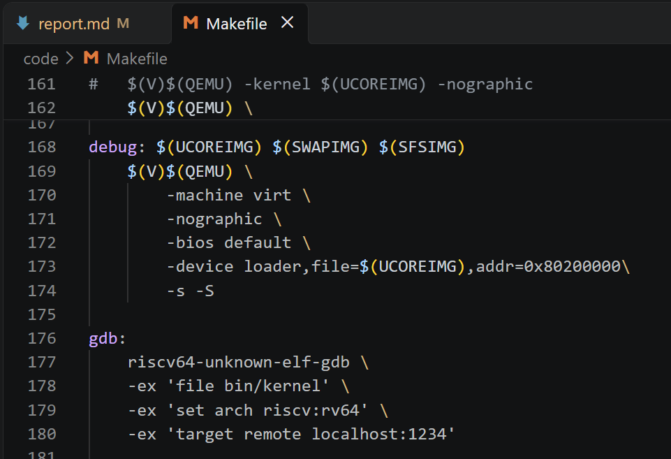
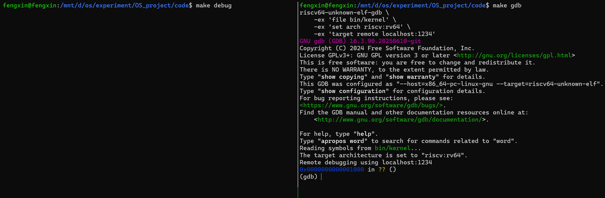
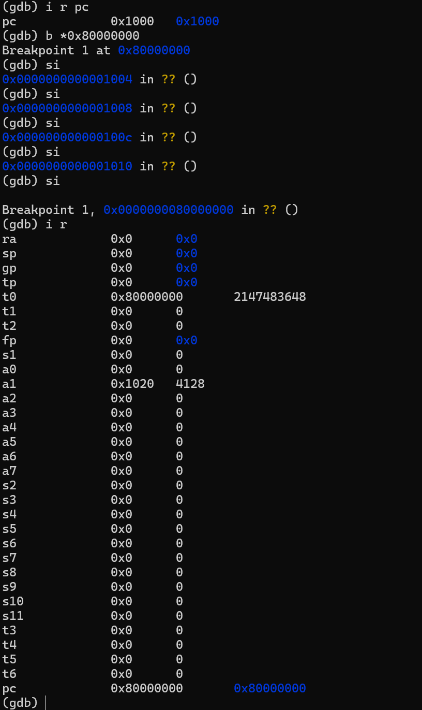
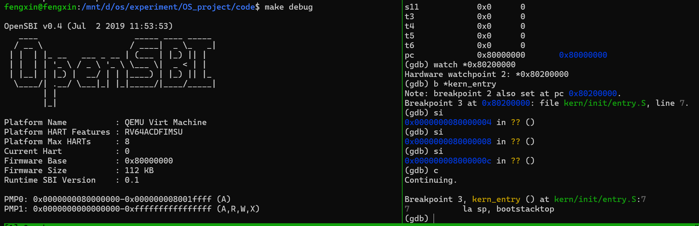
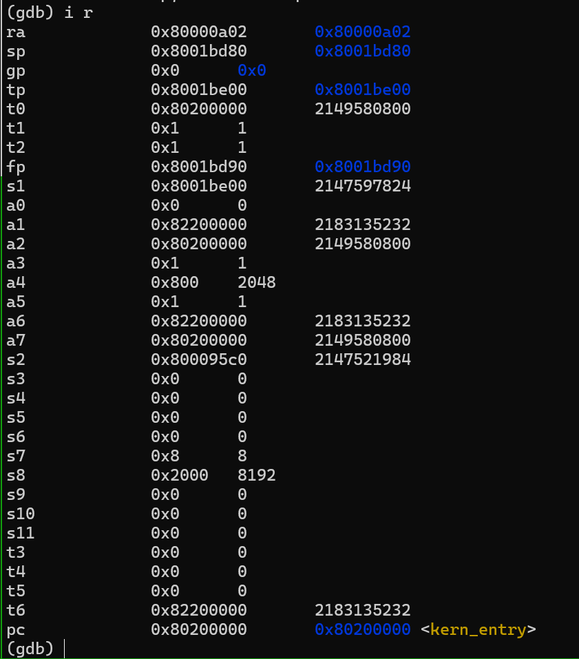
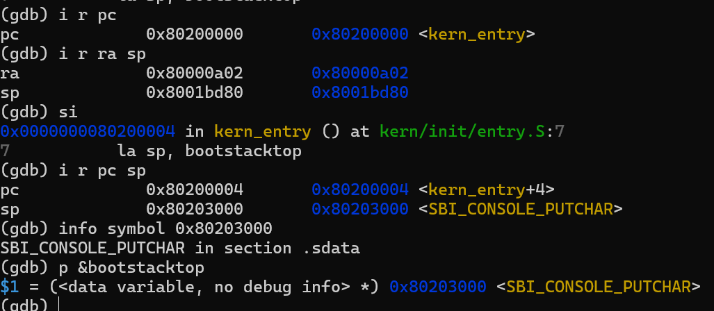
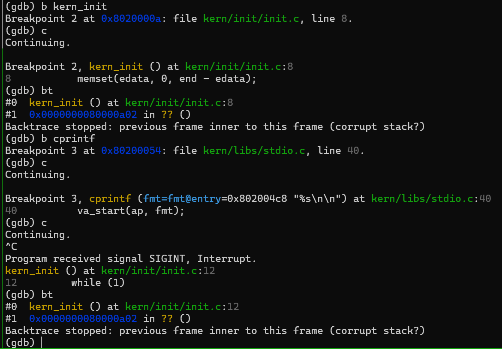
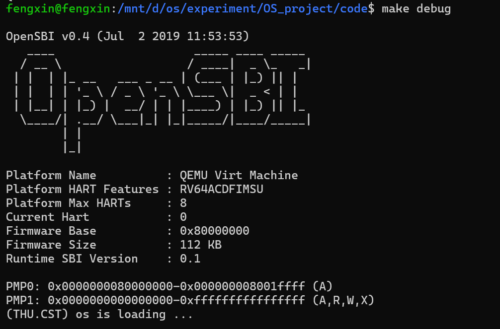
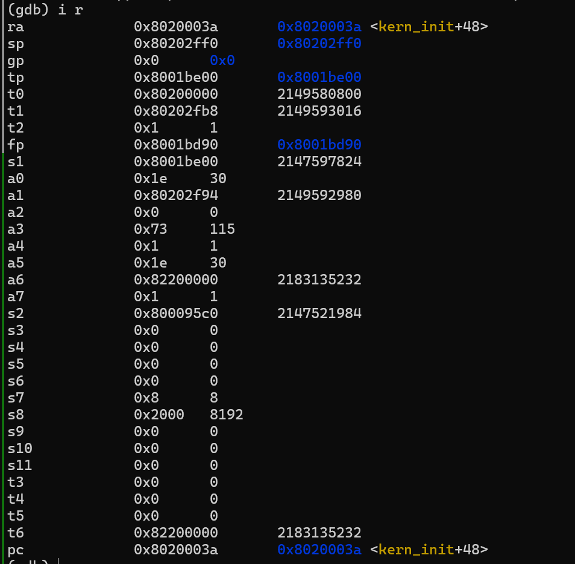

# 操作系统实验报告

## 实验基本信息

| 项目 | 内容 |
|------|------|
| **实验名称** | Lab 1: 最小可执行内核 |
| **小组成员** | 2413396-范珂祎、2413406-黄婉文、2413671-吕旭婧 |
| **完成日期** | YYYY-MM-DD |

### 小组分工

练习如何分工？

| 成员 | 负责的练习/模块 |
|------|----------------|
| 2413396-范珂祎 | [练习或模块名称] |
| 2413406-黄婉文 | 练习2 |
| 2413671-吕旭婧 | [练习或模块名称] |

实验报告如何分工？

| 成员 | 负责的部分 |
|------|----------------|
| 2413396-范珂祎 | [练习或模块名称] |
| 2413406-黄婉文 | 实验内容练习2，测试与验证，实验总结与收获 |
| 2413671-吕旭婧 | [练习或模块名称] |

---

## 一、实验目的

<!-- 说明本次实验的主要目标和预期成果 -->

本实验的主要目的是：

1. [目的1：例如，理解用户态进程如何通过系统调用进入内核]
2. [目的2：例如，掌握进程创建、执行、退出的完整生命周期]
3. [目的3：例如，学习使用 AI 辅助开发操作系统核心功能]

---

## 二、实验环境

你们使用的 AI 工具

| 成员 | AI 编程工具 | 底层模型 | 备注 |
|------|------------|---------|------|
| 2413396-范珂祎 | [例如：Cline（VS Code插件） / Claude Code（终端 Agent） / DeepSeek Harness等] | [例如：Claude Sonnet 4.5 / GPT-5.5 / DeepSeek-V4-Flash等] | [可选：特殊配置等] |
| 2413406-黄婉文 | VS Code + codex CLI | DeepSeek-V4-flash | 无 |
| 2413671-吕旭婧 | | | |

**说明：**
- **AI 编程工具**：指具体使用的终端工具、编辑器插件、桌面应用或浏览器界面
- **底层模型**：指该工具使用的大语言模型及版本

---

## 三、实验整体逻辑分析

### 2.1 本章节的逻辑主线

[请用自己的话描述本章实验的核心主线，例如：
- 本章围绕哪个核心主题展开？（例如：用户进程管理、虚拟内存、文件系统等）
- 整个实验解决什么问题？（例如：如何让用户程序运行在操作系统之上）]

### 2.2 功能的逐步实现

[说明本章实验是按照什么顺序逐步实现各个功能的，以及为什么要按这个顺序，例如：

1. 首先实现**功能A** → 为什么首先实现这个？（例如：建立系统调用接口是后续所有用户态功能的基础）
2. 接着再完善**功能B** → 为什么接着实现这个？（例如：有了系统调用后，需要能够加载和启动第一个用户进程）
3. 然后完成**功能C** → 为什么然后实现这个？（例如：有了第一个进程后，需要实现进程复制功能）
4. 最后补充了**功能D** → 为什么最后实现这个？（例如：最后完善进程退出和清理机制，形成完整闭环）]

---

## 四、实验内容与实现

<!-- 
说明：本部分按照 exercises 文档中的练习顺序组织
每个功能模块或者练习中可能包含多项任务，请根据实际情况调整
-->

### 练习1：理解内核启动中的程序入口操作

**负责人：** [学号-姓名]

[按照练习的具体要求进行解答]

---

### 练习2：使用GDB验证启动流程

**负责人：** 2413406-黄婉文

#### 练习内容：

使用 GDB 跟踪 QEMU 模拟的 RISC-V 从加电开始直到执行内核第一条指令（跳转到 0x80200000）的整个过程，说明 RISC-V 硬件加电后最初执行的几条指令的地址以及主要功能。

#### 调试过程：

1. 准备调试

**启动qemu：** 使用tmux分屏，终端1输入make debug启动被调试目标qemu；执行后qemu会暂停，等待GDB连接。

如图，在Makefile的TARGETS部分里定义了debug和gdb目标，debug中的-s参数表示打开 GDB 调试服务，监听 1234 端口；-S表示CPU 动后立即暂停，等待gdb连接后再继续。

**启动gdb：** 终端2输入make gdb，启动gdb调试器。

file bin/kernel表示让GDB加载编译好的内核文件，包含函数名、变量名等调试符号；set arch riscv:rv64 表示目标架构为 RISC-V 64 位程序；target remote localhost:1234 表示让GDB连接localhost的1234端口，也就是QEMU监听的端口。

如图，GDB成功连上QEMU后，提示程序停在了0x0000000000001000地址。

2. 硬件初始化和固件启动

**加电复位：** 在gdb中使用i r pc指令查看程序计数器pc，发现此时pc=0x1000，这是qemu模拟的 RISC-V 的复位地址。下一步程序会从这里开始执行固件代码MROM。MROM是QEMU 模拟的 RISC-V 处理器在加电后最先执行的一小段内置固件代码，它会完成最基本的环境准备，并将控制权交给OpenSBI（跳转到0x80000000）。

**加载OpenSBI：** 接下来OpenSBI会被加载到物理内存 0x80000000 处。使用b *0x80000000指令在该地址打断点，然后使用si指令单步调试观察MROM的执行过程，验证 MROM 跳转到 OpenSBI。

3. OpenSBI 初始化与内核加载

OpenSBI 运行在 RISC-V 的最高特权级（M 模式），负责初始化处理器的运行环境。完成初始化工作后，OpenSBI开始加载并启动操作系统内核，将编译生成的内核镜像文件加载到物理内存的0x80200000地址处。

跟踪验证 OpenSBI 把内核加载到 0x80200000，并跳转过去执行 kern_entry。使用watch *0x80200000观察内核加载瞬间，并用b *kern_entry在内核入口打断点。使用c指令继续执行程序，直到运行到断点处停止。此时终端1也打印了OpenSBI的信息。

使用i r指令检查寄存器状态，发现pc=0x80200000 <kern_entry>，成功到达内核入口。

   
4. 内核启动执行

OpenSBI 完成相关工作后，跳转到了0x80200000地址，到这一步控制权已由OpenSBI移交给内核，准备执行第一条指令，我们可以继续观察内核的执行。

由于链接脚本将entry.S中的代码段放在内核镜像的最开始位置，0x80200000这个地址上存放的是kern/init/entry.S文件编译后的机器码，因此开始执行entry.S。entry.S设置内核栈指针，为C语言函数调用分配栈空间，准备C语言运行环境，然后按照RISC-V的调用约定跳转到kern_init()函数。最后，kern_init()调用cprintf()输出一行信息，表示内核启动成功，然后进入死循环。

如图，首先查看0x80200000地址下sp的值，然后单步执行后再次查看，观察到sp更新为0x80203000，即 bootstacktop 的地址，验证了entry.S 通过 la sp, bootstacktop 把栈指针设置为内核栈顶。

然后在kern_init打断点，继续执行程序，停止后执行bt查看调用栈，发现确实跳转到了kern_init()。最后在cprintf打断点，执行发现终端1输出os is loading ... ，程序停在 kern_init 的 while(1)死循环，内核执行完成。

#### 问题解答：

**RISC-V 硬件加电后最初执行的几条指令位于什么地址？它们主要完成了哪些功能？**

**答：** RISC-V 硬件加电后，PC 被初始化为复位地址 0x1000。最初执行的几条指令位于 0x1000 附近（0x1004、0x1008、0x100c、0x1010），是 QEMU 内置的 MROM 固件代码。MROM 完成最基本的环境准备后，跳转到 0x80000000，把控制权交给 OpenSBI。

---

## 五、测试与验证

<!-- 根据该实验的具体情况，提供完整的测试运行截图，应包含：
- 编译及运行成功的输出（make qemu），可能有多个
- 测试通过的结果（make grade），只有一个
-->

**练习2测试截图：**

以下为内核启动执行后的qemu以及调试截图：

---

## 六、实验总结与收获

### 对操作系统的理解

1. 列出你们认为本实验中重要的知识点，以及与对应的 OS 原理中的知识点，并简要说明二者的含义、关系和差异
2. 列出你们认为 OS 原理中很重要、但在本实验中没有对应上的知识点

---

